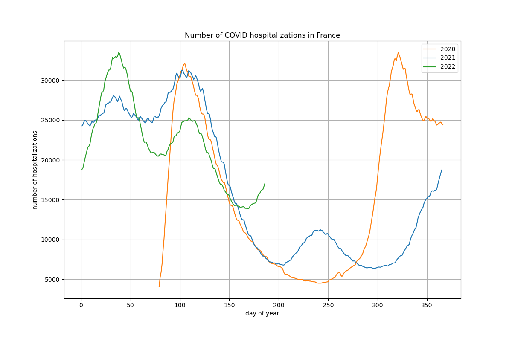

# COVID-19 evolution in France: hospitalizations and deaths in French departments

Visualize evolution of the number of people hospitalized in French departments due to COVID-19 infection

COVID-19 and geographical data come from the [French open data portal](https://www.data.gouv.fr/fr/)

Data are stored as [pandas](https://pandas.pydata.org/) / [GeoPandas](http://geopandas.org/) dataframes

The map background is built with [contextily](https://github.com/darribas/contextily)

The final animated gif is built with matplotlib

 

Example: hospitalizations year after year

Example: Evolution of the number of people hospitalized in French departments due to COVID-19 infection (one year of data)

Example: Evolution of hospitalizations in critical departments (one year of data)

Example: Plot data of one specific French department (e.g. 31 - Haute-Garonne)

## Running the tests

Run the different notebooks to generate curves and map:

* year-after-year: visualize hospitalizations for each day year after year

* demo-2021-vs-2020: hospitalizations and deaths of 2020 and 2021 on the same plot

* demo-covid-v2: build the animated gif with the map of France (demo-covid is deprecated)

* demo-stats: basic stats on COVID-19 data

* demo-plot-alldepts: plot evolution curves of most critical departments

* demo-31: plot the data of a specific department (e.g. 31)

## Built With

* [pandas](https://pandas.pydata.org/) - Python Data Analysis Library

* [GeoPandas](http://geopandas.org/) - GeoPandas is an open source project which extends the datatypes used by pandas to allow spatial operations on geometric types. 

* [contextily](https://github.com/darribas/contextily) - Context geo-tiles in Python

## Versions

Code executed with: Python 3.8.5, geopandas 0.8.1, pyproj 3.0.0

Warning: you have to create folders tmp and img at the root to save images for demo-covid

## Authors

* **Thomas Dubot** 

## License

This project is licensed under the MIT License - see the [LICENSE.md](LICENSE.md) file for details

## Acknowledgments

Data are provided by the [French open data portal](https://www.data.gouv.fr/fr/). More information here:

https://www.data.gouv.fr/fr/datasets/donnees-relatives-a-lepidemie-du-covid-19/

https://www.data.gouv.fr/fr/datasets/contours-des-departements-francais-issus-d-openstreetmap/